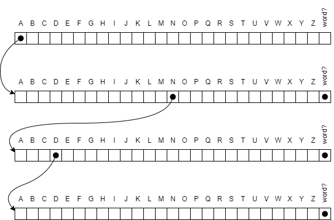

# Trie

The trie (pronounced like "try," even though it is derived from re**trie**val) data structure is a tree structure used for storing strings. Each node in the tree has 26 children, one for each letter of the alphabet. It also contains a flag indicating whether the node is the end of a word.

A trie is efficient for storing strings that have a common prefix. For example, the words A, AN, and AND would be stored in a trie that looks like this:



## Features

- Case-insensitive word storage and lookup
- Efficient prefix-based string storage
- Input validation for letters only (A-Z, a-z)
- Simple API with Add and Contains methods
- Node statistics tracking

## Project Structure

The solution consists of three projects:

- **Trie**: The core library implementing the trie data structure
- **TrieTest**: Unit tests covering the trie implementation
- **SpellCheck**: A demo application that uses the trie for spell checking

## Demo Application

As a demonstration, I implemented a simple spell checker app. It loads a list of 10,000 words from MIT's word list, prints some statistics about the trie, and spell checks Trump's infamous "covfefe" tweet.

The output looks like this:

```plaintext
10,000 words in 24,179 nodes
Unknown words:
covfefe
```

## Implementation Notes

The implementation prioritizes readability over performance. Some notable aspects:

- The trie only accepts letter characters (A-Z, case insensitive)
- Each node contains a boolean flag indicating if it represents the end of a word
- Child nodes are stored in a fixed-size array with 26 slots (one per letter)

### Performance Considerations

While functional, there are several potential optimizations that were not implemented:

- Child index calculation is performed on every access
- Leaf nodes (which are always empty) could be reused as a static instance
- The child array size is fixed at 26 regardless of actual usage

## License

This project is licensed under the GNU General Public License v2.0 - see the [LICENSE](LICENSE) file for details.
